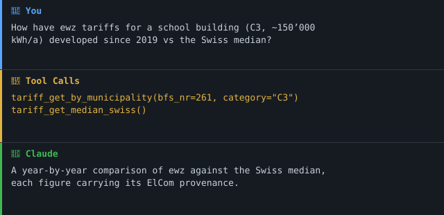

# swiss-electricity-mcp

> **MCP-Server für Schweizer Strom-Daten — drei offizielle Quellen, zwölf Tools, keine Authentifizierung.**

[](https://github.com/malkreide/swiss-electricity-mcp/actions/workflows/test.yml)
[](https://pypi.org/project/swiss-electricity-mcp/)
[](https://pypi.org/project/swiss-electricity-mcp/)
[](LICENSE)

🌍 **Read this in your language:** [🇬🇧 English](README.md)

Teil des **[Swiss Public Data MCP Portfolio](https://github.com/malkreide/swiss-public-data-mcp)** — ein koordiniertes Set von MCP-Servern für die öffentliche Verwaltung der Schweiz.

---

## Anker-Demoabfrage

> *«Wie haben sich die ewz-Stromtarife für ein typisches Schulgebäude (Verbrauchskategorie C3, ≈150'000 kWh/a) seit 2019 entwickelt, und wie liegen sie im Vergleich zum Schweizer Median?»*

Ein einziges Gespräch ruft `tariff_get_by_municipality` (bfs_nr=261, category="C3") + `tariff_get_median_swiss` und liefert einen Jahresvergleich mit vollständiger Provenance — bereit für eine Geschäftsleitungs-Folie.

### Demo



---

## Was steckt drin

Drei offizielle Schweizer Datenquellen, kombiniert in einem MCP-Server, jede mit ihrer eigenen Tool-Gruppe:

| Quelle | Was sie liefert | Provenance |
|---|---|---|
| **Energiedashboard.ch** (Bundesamt für Energie) | Nationaler Produktionsmix, Verbrauchsprognose, Speicherseen-Füllstand, Endverbraucher-Strompreis-Index | `live_api` |
| **ElCom-Strompreis-Cubes** (via LINDAS SPARQL) | Tarife pro Gemeinde, Kategorie, Jahr, vollständig aufgeschlüsselt (Energie + Netznutzung + KEV + Abgaben) | `sparql` |
| **opendata.swiss + Stadt Zürich OGD** (CKAN) | Dataset-Discovery für Rohzeitreihen (z. B. Viertelstundenwerte NE5/NE7) | `live_api` |

**Keine Authentifizierung notwendig.** Alle Endpunkte sind öffentliche Schweizer OGD.

---

## Tools (12)

### `dashboard_*` — Energiedashboard.ch (BFE)

- **`dashboard_get_production_mix`** — Produktionsmix pro Jahr (TWh + %): Kernkraft, Wasserkraft, PV, Wind, thermisch.
- **`dashboard_get_consumption_forecast`** — Aktuelle Verbrauchsprognose + 5-Tages-Ausblick + 5-Jahres-Vergleich.
- **`dashboard_get_storage_lakes`** — Speichersee-Füllstand (Schweiz oder pro Region: Wallis, Tessin, Graubünden, Zentral/Ost) — kritischer Versorgungssicherheits-Indikator.
- **`dashboard_get_consumer_price_index`** — Endverbraucher-Strompreis-Index (Basis 2020-01-01 = 100).

### `tariff_*` — ElCom (via LINDAS SPARQL)

- **`tariff_list_categories`** — H1–H8 (Haushalte) und C1–C7 (Gewerbe). **C3 ≈ 150'000 kWh/a ist die typische Referenz für Schulgebäude.**
- **`tariff_get_by_municipality`** — Tarife für eine BFS-Nr + Kategorie + Jahresbereich, aufgeschlüsselt in Energie / Netznutzung / KEV / Abgaben.
- **`tariff_get_median_swiss`** — Schweizerischer Median-Tarif als Vergleichsmassstab.
- **`tariff_get_median_canton`** — Kantonaler Median (z. B. für Kanton Zürich).
- **`tariff_compare_municipalities`** — Vergleich von bis zu 20 Gemeinden nebeneinander.

### `consumption_*` — opendata.swiss + Stadt Zürich OGD

- **`consumption_search_bfe_datasets`** — CKAN-Suche über BFE-publizierte Datensätze.
- **`consumption_search_zurich`** — CKAN-Suche über Stadt Zürich OGD (inkl. Viertelstundenwerte NE5/NE7).

### Status

- **`electricity_check_status`** — Liveness-Probe über alle vier Upstream-Quellen (HTTP-Status + Latenz + Gesamtzustand).

---

## Installation

### Von PyPI

```bash
pip install swiss-electricity-mcp
```

### Aus dem Quellcode

```bash
git clone https://github.com/malkreide/swiss-electricity-mcp.git
cd swiss-electricity-mcp
pip install -e ".[dev]"
```

---

## Verwendung mit Claude Desktop

In `claude_desktop_config.json` hinzufügen:

```json
{
  "mcpServers": {
    "swiss-electricity": {
      "command": "swiss-electricity-mcp"
    }
  }
}
```

---

## Cloud-Deployment (Streamable HTTP)

```bash
SWISS_ELECTRICITY_TRANSPORT=streamable-http \
SWISS_ELECTRICITY_HOST=0.0.0.0 \
SWISS_ELECTRICITY_PORT=8000 \
swiss-electricity-mcp
```

Funktioniert auf Render.com, Railway, Fly.io.

---

## Architektur

**Hybrid (Live-API + SPARQL + CKAN-Discovery)**, ohne Authentifizierung. Drei Gründe, weshalb das die richtige Form ist:

1. **Unterschiedliche Latenz-Profile pro Quelle**: Energiedashboard antwortet in ~200 ms (sehr live-tauglich); LINDAS SPARQL ist langsamer und gibt gelegentlich 504 zurück (längeres Timeout + 3 Retries); CKAN liefert nur Metadaten und ist inhärent sicher.
2. **Unterschiedliche Aktualisierungs-Kadenzen**: Dashboard aktualisiert intraday; ElCom-Tarife einmal pro Jahr; OGD-Datensätze sind monatelang stabil. Pro Quelle differenzierte TTL-Caches (600 s / 3600 s) tragen dem Rechnung.
3. **Domänen-Trennung gegenüber `swiss-energy-mcp`**: jener Server deckt Geo- und Infrastrukturdaten ab (Kraftwerke, Netzleitungen). `swiss-electricity-mcp` deckt Zeitreihen und Tarife ab. Beide kombinieren sich sauber.

### Provenance-Disziplin

Jede Tool-Antwort ist ein Pydantic-Envelope und trägt:

- `source` — vollständige Quellenangabe (z. B. *«Daten: Bundesamt für Energie (BFE)…»*).
- `provenance` — genau einer der Werte `live_api` / `sparql` / `cached` / `weekly_dump` / `stale_cache_fallback`.
- `retrieved_at` — ISO-8601-UTC-Zeitstempel.

Damit wird eine versehentliche Falschattribution strukturell unmöglich.

### Resilienz

- **Retry**: 3 Versuche mit exponentiellem Backoff (2 s / 4 s / 8 s).
- **5xx + 429**: werden wiederholt. **4xx (ausser 429)**: werden sofort weitergereicht (permanenter Client-Fehler).
- **In-Memory-TTL-Cache**: quellenspezifische TTLs reduzieren Upstream-Last und Round-Trips in mehrstufigen Agent-Workflows.

---

## MCP-Protokollversion

Dieser Server bedient **zwei Protokoll-Aeren** ueber denselben Endpunkt. Die
erste Anfrage einer Verbindung entscheidet, welche gilt; ein spaeterer Anspruch
aus der jeweils anderen Aera wird abgewiesen.

| Aera | Revision | Wer sie erreicht |
|---|---|---|
| `initialize`-Handshake | `2024-11-05` … **`2025-11-25`** | Was heutige Clients sprechen. Der Server antwortet mit der angefragten Revision — oder mit der Obergrenze `2025-11-25`, wenn die Anfrage etwas Neueres verlangt. |
| Pro-Request-Envelope | **`2026-07-28`** | Eine Anfrage mit dem `2026-07-28`-`_meta`-Envelope oeffnet eine moderne Verbindung. |

Beide Revisionen sind in
[`tests/test_protocol_version.py`](tests/test_protocol_version.py) gepinnt und
werden gegen das installierte SDK geprueft; ein Dependabot-Bump von `mcp` kann
also keine der beiden still verschieben. Die Handshake-Obergrenze wird an einem echten `initialize` durch den
zusammengebauten ASGI-Stack gemessen, nicht aus einem Konstantennamen
abgelesen.

Zu beachten: `LATEST_PROTOCOL_VERSION` im SDK ist ein Alias auf die **moderne**
Aera, nicht auf die Handshake-Aera — wer nur dagegen pinnt, laesst genau die
Aera frei wandern, die heutige Clients tatsaechlich aushandeln.

**Update-Politik.** Faellt das Gate, die Konstante nicht blind nachziehen: erst
das Spec-Changelog zwischen den beiden Revisionen lesen, pruefen, ob sich der
Server weiterhin richtig verhaelt, dann Konstante, diesen Abschnitt, `README.md`
und [`CHANGELOG.md`](CHANGELOG.md) gemeinsam bewegen.

---

## Tests

```bash
# Unit-Tests (gemockt, schnell, CI-Standard)
PYTHONPATH=src pytest tests/ -m "not live" -v

# Live-Tests (gegen reale Upstreams)
PYTHONPATH=src pytest tests/ -m live -v
```

19 Unit-Tests decken die drei Vertragsschichten ab: **Happy** (Antwort-Parsing), **Retry** (5xx, 429, 4xx), **Timeout** (Netzwerkfehler → saubere `UpstreamUnreachableError`) plus Envelope-/Attribution-Invarianten.

### Woher die Testdaten stammen

Die Fixtures unter `tests/fixtures/` sind **von den echten Quellen
aufgezeichnet** und datiert. Quelle, Abrufdatum, Auswahlregel und SHA-256 je
Datei: [`tests/fixtures/PROVENANCE.md`](tests/fixtures/PROVENANCE.md).

```bash
python scripts/record_fixtures.py   # neu aufzeichnen
```

**Die Anfragen baut der Produktivcode.** Das Skript ruft `ElComSparqlClient` und
`EnergyDashboardClient` auf und fängt die Antwort über einen httpx-Transport ab,
statt die SPARQL-Abfragen daneben noch einmal zu tippen. Eine Fixture, die eine
leicht andere Frage beantwortet als der Server stellt, belegt die falsche
Antwort — und zwar unauffällig, weil sie plausibel aussieht. Bei 40 Zeilen
SPARQL ist «leicht anders» der Normalfall, nicht die Ausnahme.

Zwei Auswahlregeln sind bewusst mehr als «die ersten N»:

- **Die Speicherseen-Reihe läuft in die Zukunft.** Nach dem letzten gemessenen
  Tag folgen Zeilen ohne Messung — am Aufzeichnungstag 94 Stück. Sie bleiben
  absichtlich drin: Ohne sie könnte kein Test zeigen, dass das Werkzeug sie
  überspringt.
- **Was als Messung zählt, steht je Datei ausgeschrieben und wird nicht
  geraten.** Die erste Fassung nahm «irgendein Feld ausser `date` ist nicht
  null» — falsch, denn die Zukunftszeilen tragen sehr wohl Werte (die
  Fünfjahres-Referenzkurven), nur keine Messung.

Wo eine Suche gekürzt ist, bleibt `count` auf dem echten Wert: Er sagt, wie viel
**nicht** in der Datei steht.


---

## Bekannte Einschränkungen

- **LINDAS-SPARQL-504-Timeouts**: der öffentliche LINDAS-Endpunkt gibt unter Last gelegentlich 504 zurück. Die 3-Retry-Strategie deckt transiente Fälle ab; persistente Nichtverfügbarkeit erscheint als `UpstreamUnreachableError`.
- **Keine historischen PV/Wind-Details**: das Energiedashboard liefert nur aggregierten Produktionsmix auf Jahresebene. Für unterjährige PV oder Wind via `consumption_search_bfe_datasets`.
- **Keine FHIR- oder Smart-Meter-Daten**: nicht im Scope. Zukünftige Arbeit könnte einen `swiss-prosumer-mcp` o. ä. ergänzen.
- **Jahresabdeckung**: ElCom-Tarifdaten beginnen 2009. Energiedashboard-Mix beginnt 2014.

---

## Portfolio-Synergien

Dieser Server kombiniert sich natürlich mit anderen Portfolio-Servern:

- **+ `swiss-energy-mcp`** — Geo- und Asset-Daten (Kraftwerke) mit Zeitreihen und Tarifen für umfassende Energie-Infrastruktur-Analyse.
- **+ `meteoswiss-mcp`** — Verbrauchsprognosen mit Wetter korrelieren (Temperatur treibt Heiz-/Kühl-Last).
- **+ `fedlex-mcp`** — Tarifdaten mit dem Stromversorgungsgesetz (StromVG) für Compliance-/Rechtskontext.
- **+ `zh-education-mcp`** — Schulamt-relevante Abfragen mit Tarifen, Schulzahlen, Infrastruktur-Budgets.

---

## Datenquellen & Lizenzierung

Alle Upstream-Daten sind **Open Government Data Schweiz (OGD-CH)**:

- **Energiedashboard.ch** © Bundesamt für Energie BFE — *Open Data, frei verwendbar.*
- **ElCom / LINDAS** © Eidgenössische Elektrizitätskommission ElCom — *CC BY 4.0.*
- **opendata.swiss** © diverse Schweizer Behörden — *meist CC0 / CC BY 4.0.*
- **Stadt Zürich OGD** © Stadt Zürich — *CC0.*

Dieser MCP-Server ist unter MIT-Lizenz veröffentlicht (siehe [LICENSE](LICENSE)). Die Originalquelle ist stets zu zitieren — der Antwort-Envelope enthält die korrekte Quellenangabe automatisch.

---

## Mitwirken

Siehe [CONTRIBUTING.de.md](CONTRIBUTING.de.md).

## Sicherheit

Siehe [SECURITY.de.md](SECURITY.de.md) für die Sicherheitsrichtlinie und das
Melden von Schwachstellen.

## Lizenz

MIT-Lizenz — siehe [LICENSE](LICENSE). Die Upstream-Daten behalten die unter
*Datenquellen & Lizenzierung* oben genannten Lizenzen.

## Autor

**Hayal Oezkan** · [github.com/malkreide](https://github.com/malkreide)

## Changelog

Siehe [CHANGELOG.md](CHANGELOG.md).
